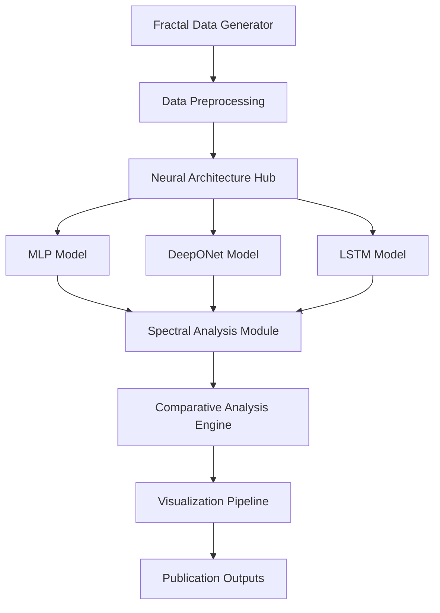

# Design Document

## Overview

The Koopman Fractal Spectral Learning system is designed as a modular Python framework that combines fractal dynamical systems theory with deep learning for operator approximation. The architecture separates data generation, model training, spectral analysis, and comparative evaluation into distinct, reusable components.

The system follows a pipeline architecture where fractal trajectory data flows through multiple neural network architectures to learn Koopman operator approximations, followed by spectral extraction and comparative analysis.

## Architecture

### High-Level System Architecture



### Core Components

1. **Fractal Data Generator**: Generates trajectory datasets from IFS and Julia set systems
2. **Neural Architecture Hub**: Manages multiple model implementations with unified interfaces
3. **Spectral Analysis Module**: Extracts eigenvalues and eigenfunctions from trained models
4. **Comparative Analysis Engine**: Benchmarks model performance across multiple metrics
5. **Visualization Pipeline**: Creates publication-ready figures and plots

## Components and Interfaces

### Fractal Data Generator

**Purpose**: Generate high-quality trajectory datasets from fractal dynamical systems

**Key Classes**:
- `IFSGenerator`: Implements Sierpinski gasket and Barnsley fern systems
- `JuliaSetGenerator`: Implements Julia set and other chaotic map dynamics
- `TrajectoryDataset`: Manages trajectory data with train/validation/test splits

**Interface**:
```python
class FractalGenerator:
    def generate_trajectories(self, system_type: str, n_points: int) -> np.ndarray
    def save_dataset(self, data: np.ndarray, filepath: str) -> None
    def visualize_attractor(self, data: np.ndarray, save_path: str) -> None
```

### Neural Architecture Hub

**Purpose**: Unified interface for multiple neural network implementations

**Key Classes**:
- `MLPKoopman`: Multi-layer perceptron for baseline Koopman learning
- `DeepONetKoopman`: Deep operator network with branch-trunk architecture
- `LSTMKoopman`: Recurrent network for temporal dynamics modeling
- `ModelTrainer`: Unified training interface across architectures

**Interface**:
```python
class KoopmanModel:
    def forward(self, x: torch.Tensor) -> torch.Tensor
    def get_operator_matrix(self) -> np.ndarray
    def train_step(self, batch: torch.Tensor) -> float
    def evaluate(self, test_data: torch.Tensor) -> Dict[str, float]
```### S
pectral Analysis Module

**Purpose**: Extract and analyze spectral properties from trained Koopman operators

**Key Classes**:
- `SpectralExtractor`: Computes eigenvalues and eigenvectors from learned operators
- `SpectrumVisualizer`: Creates complex plane plots and eigenfunction visualizations
- `DMDBaseline`: Implements Dynamic Mode Decomposition for comparison

**Interface**:
```python
class SpectralAnalyzer:
    def extract_spectrum(self, model: KoopmanModel) -> Tuple[np.ndarray, np.ndarray]
    def compare_with_dmd(self, data: np.ndarray) -> Dict[str, np.ndarray]
    def visualize_spectrum(self, eigenvals: np.ndarray, save_path: str) -> None
    def compute_spectral_error(self, learned_vals: np.ndarray, reference_vals: np.ndarray) -> float
```

### Comparative Analysis Engine

**Purpose**: Benchmark and compare performance across different neural architectures

**Key Classes**:
- `ModelComparator`: Manages fair comparison protocols across models
- `MetricsTracker`: Tracks training loss, accuracy, and computational metrics
- `BenchmarkRunner`: Executes controlled experiments with identical conditions

**Interface**:
```python
class ComparativeAnalyzer:
    def run_comparison(self, models: List[KoopmanModel], data: TrajectoryDataset) -> Dict
    def track_metrics(self, model_name: str, metrics: Dict[str, float]) -> None
    def generate_comparison_plots(self, results: Dict, save_dir: str) -> None
    def create_performance_table(self, results: Dict) -> pd.DataFrame
```

## Data Models

### Trajectory Data Structure

```python
@dataclass
class TrajectoryData:
    states: np.ndarray          # Shape: (n_samples, state_dim)
    next_states: np.ndarray     # Shape: (n_samples, state_dim)
    system_params: Dict         # System-specific parameters
    metadata: Dict              # Generation metadata (timestamps, seeds, etc.)
```

### Model Configuration

```python
@dataclass
class ModelConfig:
    architecture: str           # 'mlp', 'deeponet', 'lstm'
    hidden_dims: List[int]      # Layer dimensions
    learning_rate: float        # Training learning rate
    batch_size: int            # Training batch size
    epochs: int                # Training epochs
    activation: str            # Activation function type
```

### Spectral Results

```python
@dataclass
class SpectralResults:
    eigenvalues: np.ndarray     # Complex eigenvalues
    eigenvectors: np.ndarray    # Corresponding eigenvectors
    spectral_error: float       # Error vs reference spectrum
    convergence_history: List   # Eigenvalue evolution during training
```

## Error Handling

### Data Generation Errors
- **Invalid System Parameters**: Validate IFS contraction ratios and Julia set parameters
- **Insufficient Trajectory Length**: Ensure minimum trajectory length for meaningful learning
- **Numerical Instability**: Handle overflow/underflow in fractal iterations

### Training Errors
- **Gradient Explosion/Vanishing**: Implement gradient clipping and proper initialization
- **Memory Overflow**: Batch processing for large datasets
- **Convergence Failure**: Early stopping and learning rate scheduling

### Spectral Analysis Errors
- **Singular Matrix**: Handle non-invertible operator matrices gracefully
- **Complex Eigenvalue Extraction**: Robust eigenvalue computation with error bounds
- **Visualization Errors**: Handle edge cases in complex plane plotting

## Testing Strategy

### Unit Testing
- **Fractal Generators**: Verify mathematical correctness of IFS and Julia set implementations
- **Neural Architectures**: Test forward/backward passes with known inputs
- **Spectral Extraction**: Validate eigenvalue computation against analytical solutions

### Integration Testing
- **End-to-End Pipeline**: Test complete workflow from data generation to spectral analysis
- **Model Comparison**: Verify fair comparison protocols across architectures
- **Reproducibility**: Ensure identical results with fixed random seeds

### Performance Testing
- **Scalability**: Test with varying dataset sizes (10K to 50K points)
- **Memory Usage**: Profile memory consumption across different architectures
- **Training Speed**: Benchmark training time for each model type

### Validation Testing
- **Known Systems**: Test on systems with analytical Koopman operators
- **DMD Comparison**: Validate against established Dynamic Mode Decomposition results
- **Cross-Validation**: Implement k-fold validation for robust performance estimates## Imple
mentation Details

### Directory Structure Design

```
koopman-fractal-spectral-learning/
├── src/
│   ├── data/
│   │   ├── generators/          # Fractal system implementations
│   │   ├── preprocessing/       # Data preparation utilities
│   │   └── datasets/           # Dataset management classes
│   ├── models/
│   │   ├── base/               # Abstract base classes
│   │   ├── mlp/                # Multi-layer perceptron implementation
│   │   ├── deeponet/           # Deep operator network implementation
│   │   └── lstm/               # LSTM implementation
│   ├── training/
│   │   ├── trainers/           # Model training classes
│   │   ├── losses/             # Custom loss functions
│   │   └── optimizers/         # Optimization utilities
│   ├── analysis/
│   │   ├── spectral/           # Spectral analysis tools
│   │   ├── comparison/         # Model comparison utilities
│   │   └── metrics/            # Performance metrics
│   └── visualization/
│       ├── fractals/           # Fractal attractor plotting
│       ├── training/           # Training curve visualization
│       └── spectral/           # Eigenvalue spectrum plotting
├── experiments/
│   ├── configs/                # Experiment configuration files
│   ├── scripts/                # Execution scripts
│   └── notebooks/              # Jupyter exploration notebooks
├── data/                       # Generated datasets
├── models/                     # Trained model checkpoints
├── figures/                    # Publication-ready figures
└── results/                    # Experimental results
```

### Key Design Decisions

1. **Modular Architecture**: Each component (data generation, models, analysis) is independently testable and reusable

2. **Unified Model Interface**: All neural architectures implement the same `KoopmanModel` interface for seamless comparison

3. **Configuration-Driven**: Experiments are defined through configuration files for reproducibility

4. **Lazy Loading**: Large datasets are loaded on-demand to manage memory efficiently

5. **Extensible Design**: New fractal systems and neural architectures can be added without modifying existing code

### Neural Architecture Specifications

#### MLP Architecture
- **Input Layer**: State dimension (2D for most fractals)
- **Hidden Layers**: 3-5 layers with 64-512 neurons each
- **Activation**: ReLU or Tanh
- **Output Layer**: Next state prediction
- **Regularization**: Dropout (0.1-0.3) and L2 weight decay

#### DeepONet Architecture
- **Branch Network**: Processes trajectory snapshots (input functions)
- **Trunk Network**: Processes spatial coordinates
- **Combination**: Dot product of branch and trunk outputs
- **Operator Learning**: Learns mapping between function spaces

#### LSTM Architecture
- **Input**: Sequential trajectory segments
- **LSTM Layers**: 2-3 layers with 128-256 hidden units
- **Output**: Next state or sequence prediction
- **Temporal Modeling**: Captures long-term dependencies in fractal evolution

### Spectral Extraction Strategy

1. **Linear Approximation**: Extract linear operator from trained neural network
2. **Eigendecomposition**: Use NumPy/SciPy for robust eigenvalue computation
3. **Stability Analysis**: Assess eigenvalue convergence during training
4. **Comparison Protocol**: Standardized comparison against DMD and analytical results

### Performance Optimization

- **GPU Acceleration**: PyTorch CUDA support for neural network training
- **Vectorized Operations**: NumPy vectorization for fractal generation
- **Parallel Processing**: Multi-core trajectory generation
- **Memory Management**: Efficient data loading and batch processing
- **Checkpointing**: Regular model saving during long training runs